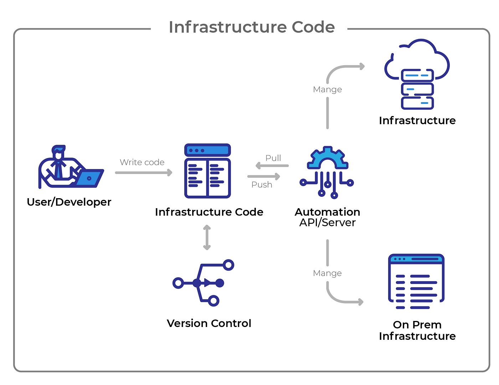

## Intro

Simple guide to compare Terraform and CDK tools.

## Setup

### General

- Docker - Docker Compose
- brew install jq

### CDK

- `npm install -g aws-cdk-local aws-cdk`
- `cd infra && npm install`

### Terraform

- `brew install terraform`
- `pip install terraform-local`

## Run tests

### CDK

- `make up`
- `make cdk-init`
- `make cdk-apply`
- `make test`

### Terraform

- `make up`
- `make tf-init`
- `make tf-apply`
- `make test`

## IaC tools

IaC (Infrastructure as Code) let's you write cloud or on premise infrastructure with some programming language.
This enables:

1. Version Control.
2. Manage infrastructure between different environments easily.
3. Shareable modules, create custom modules for enterprise use cases.

## Terraform

[Terraform Registry for AWS](https://registry.terraform.io/providers/hashicorp/aws/latest/docs)

### Commands

- terraform init
- terraform plan
- terraform apply

### Hashicorp Language

- Providers
- Variables
- Resources
- Modules
- Outputs

## CDK

[Guide](https://docs.aws.amazon.com/cdk/v2/guide/home.html)

[CDK Construct](https://constructs.dev/packages/aws-cdk-lib/v/2.88.0?lang=typescript)

### Commands

- cdk bootstrap
- cdk diff
- cdk deploy

### AWS Construct Library

- Stacks
- Constructs

## Comparison

|           | Manage multiple cloud providers     | Language                      | State                  |
| --------- | ----------------------------------- | ----------------------------- | ---------------------- |
| Terraform | Yes, using the appropriate provider | Hashicorp Language            | local, remote, s3, etc |
| CDK       | No only AWS                         | Typescript, Python, Java, etc | Cloudformation         |
